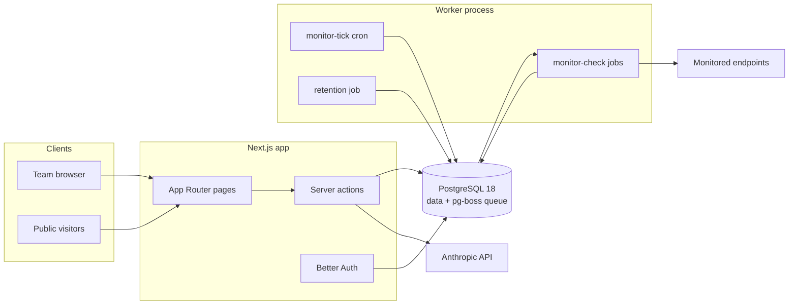
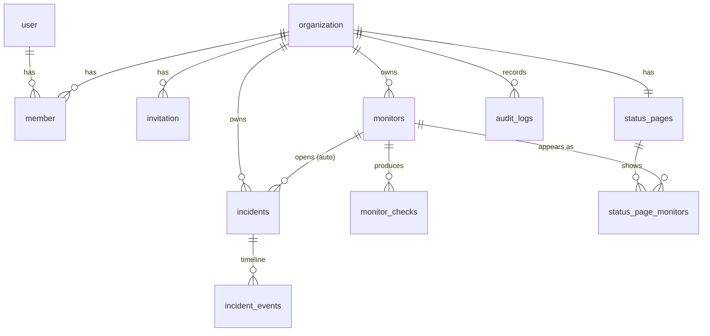

# Vigil. Architecture

This document explains how Vigil is put together and, more importantly, why.
For setup and product docs, see the [README](README.md).

## 1. System overview

Vigil is an uptime-monitoring and incident-management platform: organizations
create monitors of any of forty check types. HTTP(S), TCP port, ping, DNS
record, TLS-certificate expiry, domain expiry, PostgreSQL, MySQL/MariaDB,
MongoDB, Redis, Docker, MQTT, SMTP, JSON query, a real browser engine, and
twenty-two more spanning messaging, directory, mail and infrastructure
protocols, plus push heartbeats, groups and manual status, a background worker
probes
them on an
adapting schedule, failures open incidents automatically, and a public status
page keeps customers informed. Three of the types are not probes at all: a
push heartbeat whose silence is what gets measured, a group derived from
other monitors' states, and a manual status an operator sets by hand
(`docs/MONITOR-KINDS.md`). AI (Anthropic API) drafts postmortems and public updates from
incident timelines.

The deployment shape is deliberately small, **two processes and one
datastore**:



- **Next.js app** (`src/app`): dashboard, settings, public status pages, auth
  endpoints. All mutations are server actions.
- **Worker** (`src/worker`): a separate long-running Node process that owns
  every background job. It shares the app's code (schema, services) but not
  its runtime.
- **PostgreSQL 18**: the only stateful dependency. It stores both the domain
  data and the job queue (pg-boss creates its own `pgboss` schema).

### Why no Redis / message broker

The workload is thousands of scheduled checks per hour, not millions of
events per second. pg-boss provides scheduling, retries, per-key dedup
(`SKIP LOCKED` under the hood) inside Postgres, one datastore to operate,
back up, and reason about. If check volume ever outgrows this, the worker is
already a separate process with a queue abstraction; swapping the transport
is contained.

## 2. Code organization

```
src/
├── app/            # Next.js routes: thin, auth guard, parse, call service
│   ├── (auth)/     #   sign-in / sign-up / password reset
│   ├── (app)/      #   authenticated dashboard (sidebar shell)
│   ├── status/     #   public status pages (no auth, ISR-cached)
│   └── api/auth/   #   Better Auth handler
├── modules/        # Domain logic, framework-free
│   ├── monitors/   #   check engine, schemas, service
│   ├── incidents/  #   lifecycle state machine, service
│   ├── recovery/   #   verified recovery loop: engine, schemas, service
│   ├── status-pages/
│   ├── notifications/ #   email/webhook + escalation channels (email/sms/voice)
│   ├── oncall/        #   on-call rotation math, schedules, escalation policies
│   ├── audit/
│   └── ai/         #   Anthropic client + prompt assembly
├── worker/         # pg-boss bootstrap + job handlers
├── db/             # drizzle client + schema (one file per context)
├── lib/            # env, logger, session guards, permissions, errors
└── components/     # UI (shadcn/ui in components/ui, shared pieces above)
```

The layering rule: **routes never touch tables, services never touch the
request**. Service functions take a `DbClient` (pool or transaction) plus an
explicit actor `{ organizationId, userId }`, which makes them directly
callable from server actions, the worker, and integration tests. This is the
whole "architecture", no repositories-of-repositories, no DI container.
Bounded contexts exist as folders (`monitors`, `incidents`, `status-pages`)
with one deliberate seam: the worker composes monitors + incidents +
notifications, so _monitor state transitions_ and _incident policy_ stay in
their own modules.

## 3. Database design



Decisions worth calling out:

- **Tenancy by `organization_id` column.** Every top-level domain table carries
  it, every service query filters by it, and the org id always comes from the
  session, never from client input. Child tables (escalation steps, schedule
  members, status-page components) inherit tenancy through their parent rather
  than repeating the column, so the rule that actually has to hold is the
  second one: **every client-supplied id is resolved against the acting
  organization before it is stored, and every read that turns an id into a
  person or a page joins back to the organization.** Both directions matter,
  1.10.0 fixed a case where they did not, and the write-side check alone would
  not have been enough, because the worker has no session to fall back on.

  Row-level security was considered and skipped: one application role talks to
  the database, so RLS would duplicate the service guards without adding a
  second independent enforcement point (documented trade-off; revisit if other
  consumers get SQL access).

- **UUIDv7 primary keys** (`uuidv7()`, native in Postgres 18) for domain
  tables, time-ordered, so B-tree inserts stay append-friendly without a
  separate sort key. Auth tables keep Better Auth's text ids.
- **`monitor_checks` is append-only time series** with a
  `(monitor_id, checked_at DESC)` index; a nightly job prunes rows past 90
  days. At one check/minute that's ~130k rows/monitor kept, fine for B-tree +
  aggregate queries; partitioning would be the next step, not a today problem.
- **Cached monitor state** (`current_status`, `consecutive_failures`) lives on
  the monitor row. Deriving status from the last N checks on every dashboard
  render would be correct but needlessly expensive; the worker is the only
  writer, so the cache has a single owner.
- **`incident_events` is the immutable record**: status changes, updates and
  system actions are events; the incident row holds only current state.
- **Audit log** rows are written in the same transaction as the mutation they
  describe, so the trail can't drift from the data.

## 4. Authentication & authorization

- **Better Auth** with the organization plugin: email+password sessions
  (cookie-cached, DB-backed), organizations, invitations, and member roles in
  our own Postgres.
- **Roles**: `owner`, `admin`, `responder`, `viewer`: are defined once in
  [`src/lib/permissions.ts`](src/lib/permissions.ts) as an access-control
  matrix over resources (`monitor`, `incident`, `statusPage`, `member`,
  `invitation`, `organization`). The same matrix drives the server guards,
  Better Auth's own endpoints, and conditional UI.
- **Guard chain** for every server action:
  `requirePermission(permission)` → resolves session (React `cache`d per
  request) → resolves active-org membership → checks the role matrix locally
  (no extra round-trip) → returns `{ userId, organizationId, role }` used for
  all queries.
- `proxy.ts` (Next 16's middleware successor) only does optimistic
  redirect-to-sign-in on missing session cookies; it is UX, not security.
  Real enforcement lives in layouts, pages and actions.

Auth flow (sign-in):


## 5. Monitoring pipeline

The scheduling model is a **cron fan-out**, not per-monitor timers:

1. `monitor-tick` (pg-boss cron, every minute, singleton policy) queries
   monitors that are due, `next_evaluation_at` reached, allowing 30s of
   slack for tick alignment, or never scheduled, and enqueues one
   `monitor-check` job per monitor. The query contains no interval
   arithmetic: _when_ was decided by `nextEvaluationAt(spec,
recentObservations)` when the last observation landed, so changing the
   scheduling policy never means touching the scheduler. A check whose
   next evaluation falls inside the tick period enqueues its own
   follow-up rather than waiting for the next minute.
2. `monitor-check` jobs run with per-monitor dedup (queue policy `stately` +
   `singletonKey = monitorId`): at most one queued and one active check per
   monitor, so a slow target can't pile up probes. Handlers never retry.
   The next tick is the retry.
3. Each check: DNS-resolve and **refuse private address space** (SSRF guard),
   probe with timeout, and emit _facts_. The type's declared assertions are
   then judged by one shared engine into a verdict, `up`, `degraded`,
   `down`, or `indeterminate` when the probe could not run at all. The
   observation is persisted with its facts and its ledger stamp, and monitor
   state advances, in one transaction.
4. The status controller is **level-triggered**: it asks what is true now,
   never what just changed. A monitor is `down` once it has been failing for
   `failure_window_seconds`; while inside that window it keeps the last
   status actually established. Being safe to run repeatedly is the point,
   a monitor that ended up down with no incident, or up with a stale open
   one, repairs itself on the next check. `down` opens an incident
   (idempotent: one open auto-incident per monitor) and notifies
   owners/admins/responders, or holds the notifications if the monitor's
   recovery action asks to, and hands the incident to the recovery loop. An
   incident resolves only when a probe **observed** the target healthy. A
   derived status is not proof of recovery, and `indeterminate` resolves
   nothing.

This design is self-healing (a missed tick just means the next one picks up
the backlog), horizontally scalable (multiple workers coordinate through the
queue), and has no schedule state to corrupt beyond a timestamp that is
recomputed on every check.

### The check type registry

A check type is data, not a branch. `src/modules/monitors/types/` holds one
object per type, a descriptor, a zod spec, a set of declared assertions and a
probe, and dispatch is a map lookup. There is no `switch` on `checkType`
anywhere in the product, and adding a type changes no existing code path.

Two rules hold it together.

**Probes measure; the runner judges.** A probe returns _facts_ and, at most, a
transport error. It never returns `ok` or `degraded`. The verdict comes from
`judge()`, which evaluates the type's declared assertions against those facts.
Because that is a pure function of `(assertions, spec, facts)`, a stored
observation can be re-judged later, against a different spec version, or by a
verifier that never ran the probe, without re-probing anything. A type that
returned its own verdict would make the shared engine advisory and take that
property away.

**Three answers, not two.** Beyond `up` / `degraded` / `down` there is
`indeterminate`: the probe could not run here at all. ICMP without a raw
socket, a check type a downgraded build no longer has, a registry that does not
publish the field. It is deliberately not `down`, because an operator error
that is indistinguishable from an outage is the one failure a monitoring
product may not have. It reaches the operator as `unknown`, is excluded from
every uptime aggregate rather than counted as downtime, never opens an
incident, and never closes one.

The split across three directories is load-bearing rather than tidiness:
`catalog.ts` is plain data with no zod and no `node:` imports, because the
monitor form imports it into the browser; `specs/` adds validation and is
isomorphic; `probes/` reaches for `node:dns`, `node:net`, `node:tls` and
`node:child_process` and is server-only. Type-specific settings live in a
nullable `config` jsonb column, so a new type needs no migration.

### Remote probes and quorum (commercial)

A monitor can be executed by **remote probe agents** the customer runs on
their own machines instead of by the controller. Operator manual:
[docs/REMOTE-PROBES.md](docs/REMOTE-PROBES.md).

Two words in this repository are now spelled "probe" and they are not the
same thing. `modules/monitors/types/probes/*` is the function that dials a
target for one check type, and has been since 1.10.0. `modules/probes/` is a
remote agent process. The second is the customer-facing word, so it keeps the
plain name; nothing imports both.

The pipeline is unchanged above and below the seam. `runMonitorCheck` asks
`dispatchToProbes(monitor)`; a monitor with no policy or a `local` one gets
`false` and the four steps above run exactly as they always have. Otherwise:

1. **Dispatch** opens a `probe_rounds` row and one `probe_jobs` row per
   assigned probe, and freezes the membership and the thresholds into the
   round. Freezing is what makes a decision reconstructable: a policy edited
   or a probe revoked mid-round cannot change what the round was asked.
2. **Lease.** Probes poll outbound; the controller has no route to them and
   never will. One `UPDATE ... FOR UPDATE SKIP LOCKED` claims work and stamps
   a fresh `attempt_id`, which is the idempotency key and the replay defence
   in one. The job carries the spec from `toCheckSpec`, the same mapping a
   local check uses, so a remote probe can never measure a laxer version of
   the monitor.
3. **Report.** Every result is written, including refused ones, with
   `accepted = false` and a reason (`late`, `stale_attempt`, `round_decided`).
   A refused result is the evidence that a probe was slow, which is exactly
   what an operator wants when the quorum came up short. The endpoint judges
   nothing and can page nobody, for the same reason `/api/push/<token>`
   cannot.
4. **Decide.** A one-second loop in the worker settles rounds that are
   complete or past their deadline. `decideQuorum` is pure. Its output is
   converted to a `CheckResult` and handed to the same `applyOutcome`
   everything else uses, so incidents, uptime, the ledger and the status page
   cannot tell a remote monitor from a local one.

Three invariants are enforced by Postgres rather than by sequencing:

| Invariant                  | Mechanism                                                                                          |
| -------------------------- | -------------------------------------------------------------------------------------------------- |
| One open round per monitor | partial unique index on `(monitor_id) WHERE decided_at IS NULL`                                    |
| One decision per round     | `UPDATE ... SET decided_at = now() WHERE decided_at IS NULL RETURNING *`                           |
| One result per job         | unique index on `probe_results(job_id)`, plus a BEFORE UPDATE trigger making the table append-only |

The second is the whole of "incidents fire once per aggregate transition,
never once per probe".

Quorum resolves K against the frozen membership size, never against how many
answered: a threshold computed from responders would make `majority` on three
probes quietly become 2-of-2 whenever one agent was asleep. **A probe that did
not answer is never counted as a failure** in any mode; below `min_responders`
the round is `insufficient_quorum` and the verdict is `indeterminate`, which
the status controller already refuses to read as either an outage or a
recovery. Dissent below the threshold is `partial_failure` and reports
`degraded`: a target a third of the world cannot reach is not healthy and is
not an outage.

Credentials are SHA-256 in the database and nowhere else; the plaintext exists
for one response. Revocation clears both hashes _and_ sets `revoked_at`, so two
independent things have to fail before a revoked credential works. The agent
overwrites `DATABASE_URL` at start-up (`probe-agent/env-guard.ts`) so a
misplaced `.env` cannot give a remote box a database credential, and it applies
its own `ALLOW_PRIVATE_MONITOR_TARGETS` rather than anything the controller
sends.

Vigil operates no probe, region or relay. The feature ships the software; the
machines are the buyer's.

### Recovery loop

Each monitor may have one **recovery action**: a customer-controlled HTTP
endpoint (restart hook, runbook trigger) that Vigil calls with a signed
`recovery.execute` payload, same HMAC-SHA-256 scheme as webhooks. The loop
is deliberately conservative:

1. `recovery-execute` re-probes the target first, a stale detection never
   triggers anything. Still down → fire the signed trigger, then schedule
   `recovery-verify` after the configured delay.
2. `recovery-verify` probes again: success is **observed, never assumed**.
   Failure retries after a cooldown up to `maxAttempts` (1-5 per incident),
   then stands down. The incident stays open for a human.
3. Bounds beyond the per-incident cap: a fixed restart-loop guard (10
   executed triggers per monitor per 24 h, a flapping target re-opens
   incidents and would loop forever) and a nightly sweep that closes
   attempts orphaned by worker interruptions.
4. With `holdAlerts`, opened-notifications wait for the loop: a verified
   recovery pages nobody; failure, exhaustion or a worst-case deadline
   (`recovery-escalate`, scheduled up front so a dead chain can't swallow
   an alert) fires them exactly once, a `notified_at` claim on the
   incident arbitrates between the competing senders in Postgres.

Every attempt is an immutable row in `recovery_attempts` (pre-check result,
trigger delivery, verification, timings) plus system events on the incident
timeline. Resolving the incident stays owned by the regular check loop. A
verified recovery is confirmed by the next passing check.

### SSRF posture

Monitor URLs are validated twice: at input (public domain names only, no IP
literals, no localhost, metadata hostnames blocked) and at probe time (the
worker resolves DNS and rejects targets in private/link-local/CGNAT ranges
unless `ALLOW_PRIVATE_MONITOR_TARGETS` is set for development). Known residual
risk: the probe's `fetch` re-resolves DNS, so a rebinding server could flip
records between checks; full mitigation (pinning the resolved IP or an egress
proxy) is documented future work.

## 6. Public status pages

`/status/[slug]` is the unauthenticated, high-traffic surface. It is
**ISR-cached (60s revalidate)**: during an outage, traffic spikes hit the
cache, not Postgres. The read model (`getPublicStatusPage`) is assembled in
one service call and exposes only public-safe data: display names (never
URLs), daily uptime buckets, and incident timelines. System-generated
incident messages are deliberately generic because raw check errors can embed
internal hostnames.

## 7. AI features

- Server-side only (`src/modules/ai`), using `claude-opus-4-8` with adaptive
  thinking. The API key is optional, without it the UI simply doesn't offer
  AI actions.
- Two features: **postmortem drafts** (structured, blameless, grounded in the
  timeline, explicitly told to write "To be filled in" rather than invent
  facts) and **public status-update suggestions**.
- Guardrails: permission-gated server actions, per-organization rate limit
  (10 generations/hour), prompts assembled from our own data with no
  user-supplied instructions in the system prompt, and every output lands in
  an editable textarea, a human saves it, the AI never writes to the
  database.

## 8. Notifications

Notifications live in `src/modules/notifications` and have two channels
that never block incident processing. Both are dispatched _after_ the
triggering mutation has committed, and neither can throw back into it.

**Flow.** Monitor-driven events fire from the worker
(`src/worker/jobs/monitor-check.ts`) on the same reconciliation that opens
and resolves incidents, `openIncident` and `resolveIncidents` off the
status controller, not on transitions. Manual incident events fire from
the incident server actions after they commit. Both call into the same
notification functions.

**Email.** `EmailTransport` is a one-method interface. The default
transport logs structured lines; setting `RESEND_API_KEY` swaps in the
Resend transport (plain `fetch`, no SDK) at module load. Call sites are
unchanged, and a future SMTP/SES transport is another file implementing
the same interface. Templates (`email-templates.ts`) return matching
HTML and plain-text bodies; recipients are the org's owners, admins and
responders (assign roles to change who is paged). Delivery failures are
logged and swallowed.

**Webhooks.** One endpoint per organization (`webhook_endpoints`), with a
generated secret and an enable switch, configured under
_Settings → Notifications_. When enabled, Vigil POSTs a compact,
versioned JSON envelope for each event:

```json
{
  "version": 1,
  "event": "incident.opened",
  "timestamp": "2026-07-02T12:00:00.000Z",
  "organization": { "id": "…" },
  "data": {
    "incident": { "id", "title", "status", "severity", "source",
                  "startedAt", "resolvedAt", "url" },
    "monitor":  { "id", "name", "url", "status" }
  }
}
```

Events: `incident.opened`, `incident.updated`, `incident.resolved`,
`monitor.down`, `monitor.up` (plus `webhook.test`). Each request carries
`X-Vigil-Event` and `X-Vigil-Signature: sha256=<hex>`: the HMAC-SHA-256
of the exact request body keyed by the endpoint secret. Receivers verify
by recomputing the HMAC over the raw body. Delivery retries transient
failures (network errors, timeouts, 5xx, 429) with exponential backoff,
does not retry a permanent 4xx, times out per attempt, and gives up after
a bounded budget, always returning a result, never throwing.

**Escalation & on-call.** A monitor may carry an
`escalation_policy_id`. When such a monitor opens an incident, the worker
schedules the policy's ordered steps (`src/worker/jobs/escalation.ts`):
one `escalation-step` job per step, each with `startAfter =
delayMinutes × 60`. When a step fires it re-reads the incident and stops
if it is `resolved` or has an `acknowledged_at`: so acknowledging (or a
verified recovery resolving) the incident halts the whole ladder without
cancelling queued jobs. Each step resolves its target to concrete
recipients at fire time: the **on-call person** (rotation math in
`modules/oncall/rotation.ts`: pure `floor((now − anchor)/day / rotationDays)`
wrapped over the ordered members), **all responders** (owner/admin/
responder members), or a **specific person**. It then delivers over one
channel (`modules/notifications/channels.ts`): **email** (the transport
above) or **SMS/voice** via Twilio when `TWILIO_ACCOUNT_SID`,
`TWILIO_AUTH_TOKEN` and `TWILIO_FROM_NUMBER` are set, otherwise a logged
no-op. Every step records an _internal_ system event (never shown on the
public status page) summarising who was paged. Monitors with no policy
keep the original behavior: notify owners/admins/responders once.

Schedules and policies are managed under _Settings → Escalation_; a
member's escalation phone lives on their profile. The direct open path
drives the policy (it has the queue); recovery's own escalate failsafe
(no queue handle) falls back to notifying responders by email.

**Status-page subscriptions.** Visitors to a _public_ published status
page can subscribe by email (`status_page_subscribers`). Double opt-in:
subscribing writes a pending row and emails a confirmation link;
`notifyStatusPageSubscribers` only ever pages rows with a `confirmed_at`.
Confirm/unsubscribe links carry a self-authenticating token,
`${subscriberId}.${hmac(subscriberId)}` signed with `BETTER_AUTH_SECRET`,
so the server acts from the token alone, with no guessable ids in URLs
and no second secrets table. Subscribers are notified at the same seam as
webhooks (`incident.opened` / `.updated` / `.resolved`), so internal notes
and quiet self-healed incidents never reach them; the resolve path is
gated on `notifiedAt`, matching the team's own "quiet recovery stays
quiet" rule. The subscribe action is rate-limited per address so the
confirmation email can't be weaponised.

## 9. Deployment

`docker-compose.yml` runs the full stack: Postgres 18, a one-shot `migrate`
service (drizzle migrations), the standalone Next.js image, and the worker
image. CI (GitHub Actions) runs lint → typecheck → unit+integration tests
against a Postgres service → build, then Playwright e2e against a production
build, then builds both Docker images. Two more jobs guard the things a
green suite cannot see: `core-gate` strips the commercial code and proves
what is left still builds, migrates onto an empty database and serves
(`scripts/edition-gate.sh`), and `public-facts` fails if a number this
project publishes disagrees with the repository it describes
(`scripts/public-facts.mjs`). Both must be required in branch protection,
a job that is allowed to fail is a job that is not a gate.

The worker image runs TypeScript via `tsx` rather than a bundling step,
a documented trade-off: a slightly larger image in exchange for zero build
complexity and identical code paths in dev and prod.

### Scaling path

| Pressure                      | First response                                              |
| ----------------------------- | ----------------------------------------------------------- |
| More dashboard traffic        | App is stateless, add replicas behind a load balancer       |
| More monitors                 | Add worker replicas; pg-boss coordinates via the queue      |
| Check-history growth          | Tighten retention; then partition `monitor_checks` by month |
| Status-page spikes            | Already ISR-cached; add a CDN in front                      |
| Rate limiting across replicas | Move the in-memory AI limiter into Postgres/Redis           |

## 10. Trade-offs & future improvements

Shipped since the first cut: Resend email delivery, on-call schedules and
escalation policies (§8), SMS/voice via Twilio, status-page email
subscriptions (§8), and multi-region checks in 1.14.0. A monitor can be
assigned to remote probe agents the customer runs, and a quorum decides
the verdict. The infrastructure the earlier note said this needed is the
customer's: Vigil ships the agent and hosts no regions itself. See
[docs/REMOTE-PROBES.md](docs/REMOTE-PROBES.md).

Still consciously deferred, in rough priority order:

1. **DNS-rebinding-proof probes** (pin resolved IPs / egress proxy).
2. **Postgres RLS** as defense-in-depth if non-application SQL access appears.
3. **Live-updating dashboards** (SSE or polling): today data refreshes on
   navigation/mutation.
