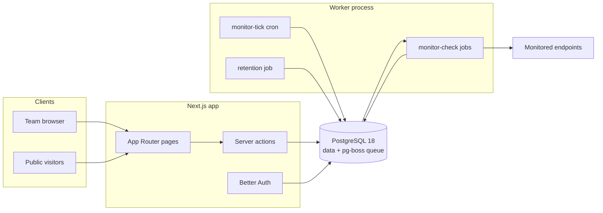
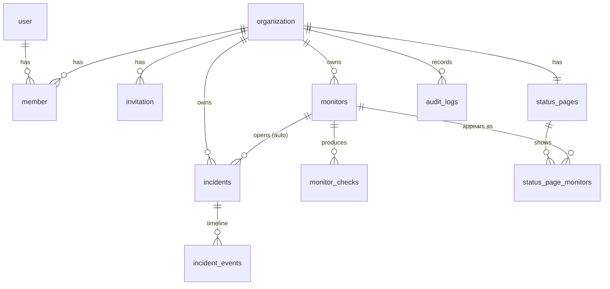
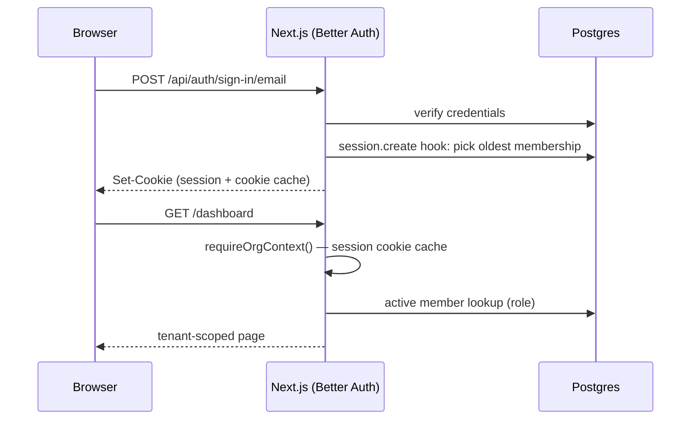

# Vigil — Architecture

This document explains how Vigil is put together and, more importantly, why.
For setup and product docs, see the [README](README.md).

## 1. System overview

Vigil is an uptime-monitoring and incident-management platform: organizations
create HTTP monitors, a background worker probes them on schedule, failures
open incidents automatically, and a public status page keeps customers
informed.

The deployment shape is deliberately small — **two processes and one
datastore**:



- **Next.js app** (`src/app`) — dashboard, settings, public status pages, auth
  endpoints. All mutations are server actions.
- **Worker** (`src/worker`) — a separate long-running Node process that owns
  every background job. It shares the app's code (schema, services) but not
  its runtime.
- **PostgreSQL 18** — the only stateful dependency. It stores both the domain
  data and the job queue (pg-boss creates its own `pgboss` schema).

### Why no Redis / message broker

The workload is thousands of scheduled HTTP checks per hour, not millions of
events per second. pg-boss provides scheduling, retries, per-key dedup
(`SKIP LOCKED` under the hood) inside Postgres — one datastore to operate,
back up, and reason about. If check volume ever outgrows this, the worker is
already a separate process with a queue abstraction; swapping the transport
is contained.

## 2. Code organization

```
src/
├── app/            # Next.js routes: thin — auth guard, parse, call service
│   ├── (auth)/     #   sign-in / sign-up
│   ├── (app)/      #   authenticated dashboard (sidebar shell)
│   ├── status/     #   public status pages (no auth, ISR-cached)
│   └── api/auth/   #   Better Auth handler
├── modules/        # Domain logic, framework-free
│   ├── monitors/   #   check engine, schemas, service
│   ├── incidents/  #   lifecycle state machine, service
│   ├── status-pages/
│   ├── notifications/ #   incident email + signed webhooks (Slack/Discord aware)
│   ├── audit/
├── worker/         # pg-boss bootstrap + job handlers
├── db/             # drizzle client + schema (one file per context)
├── lib/            # env, logger, session guards, permissions, errors
└── components/     # UI (shadcn/ui in components/ui, shared pieces above)
```

The layering rule: **routes never touch tables, services never touch the
request**. Service functions take a `DbClient` (pool or transaction) plus an
explicit actor `{ organizationId, userId }`, which makes them directly
callable from server actions, the worker, and integration tests. This is the
whole "architecture" — no repositories-of-repositories, no DI container.
Bounded contexts exist as folders (`monitors`, `incidents`, `status-pages`)
with one deliberate seam: the worker composes monitors + incidents +
notifications, so _monitor state transitions_ and _incident policy_ stay in
their own modules.

## 3. Database design



Decisions worth calling out:

- **Tenancy by `organization_id` column.** Every domain table carries it, every
  service query filters by it, and the org id always comes from the session —
  never from client input. Row-level security was considered and skipped: one
  application role talks to the database, so RLS would duplicate the service
  guards without adding a second independent enforcement point (documented
  trade-off; revisit if other consumers get SQL access).
- **UUIDv7 primary keys** (`uuidv7()`, native in Postgres 18) for domain
  tables — time-ordered, so B-tree inserts stay append-friendly without a
  separate sort key. Auth tables keep Better Auth's text ids.
- **`monitor_checks` is append-only time series** with a
  `(monitor_id, checked_at DESC)` index; a nightly job prunes rows past 90
  days. At one check/minute that's ~130k rows/monitor kept — fine for B-tree +
  aggregate queries; partitioning would be the next step, not a today problem.
- **Cached monitor state** (`current_status`, `consecutive_failures`) lives on
  the monitor row. Deriving status from the last N checks on every dashboard
  render would be correct but needlessly expensive; the worker is the only
  writer, so the cache has a single owner.
- **`incident_events` is the immutable record** — status changes, updates and
  system actions are events; the incident row holds only current state.
- **Audit log** rows are written in the same transaction as the mutation they
  describe, so the trail can't drift from the data.

## 4. Authentication & authorization

- **Better Auth** with the organization plugin: email+password sessions
  (cookie-cached, DB-backed), organizations, invitations, and member roles in
  our own Postgres.
- **Roles** — `owner`, `admin`, `responder`, `viewer` — are defined once in
  [`src/lib/permissions.ts`](src/lib/permissions.ts) as an access-control
  matrix over resources (`monitor`, `incident`, `statusPage`, `member`,
  `invitation`, `organization`). The same matrix drives the server guards,
  Better Auth's own endpoints, and conditional UI.
- **Guard chain** for every server action:
  `requirePermission(permission)` → resolves session (React `cache`d per
  request) → resolves active-org membership → checks the role matrix locally
  (no extra round-trip) → returns `{ userId, organizationId, role }` used for
  all queries.
- `proxy.ts` (Next 16's middleware successor) only does optimistic
  redirect-to-sign-in on missing session cookies; it is UX, not security.
  Real enforcement lives in layouts, pages and actions.

Auth flow (sign-in):



## 5. Monitoring pipeline

The scheduling model is a **cron fan-out**, not per-monitor timers:

1. `monitor-tick` (pg-boss cron, every minute, singleton policy) queries
   monitors that are due — `last_checked_at + interval <= now()` or never
   checked — and enqueues one `monitor-check` job per monitor.
2. `monitor-check` jobs run with per-monitor dedup (queue policy `stately` +
   `singletonKey = monitorId`): at most one queued and one active check per
   monitor, so a slow target can't pile up probes. Handlers never retry —
   the next tick is the retry.
3. Each check: DNS-resolve and **refuse private address space** (SSRF guard),
   probe with timeout, evaluate status (expected code / 2xx-3xx, degraded
   threshold), persist the check row, advance monitor state in one
   transaction, and return transition flags.
4. On `becameDown` → open an incident (idempotent: one open auto-incident per
   monitor) and notify owners/admins/responders by email and signed webhook.
   On `becameUp` → auto-resolve with a status-change timeline event and send
   the matching resolve notifications.

This design is self-healing (a missed tick just means the next one picks up
the backlog), horizontally scalable (multiple workers coordinate through the
queue), and has no schedule state to corrupt.

## 6. Public status pages

`/status/[slug]` is the unauthenticated, high-traffic surface. It is
**ISR-cached (60s revalidate)** — during an outage, traffic spikes hit the
cache, not Postgres. The read model (`getPublicStatusPage`) is assembled in
one service call and exposes only public-safe data: display names (never
URLs), daily uptime buckets, and incident timelines. System-generated
incident messages are deliberately generic because raw check errors can embed
internal hostnames.

## 7. AI features

- Server-side only (`src/modules/ai`), using `claude-opus-4-8` with adaptive
  thinking. The API key is optional — without it the UI simply doesn't offer
  AI actions.
- Two features: **postmortem drafts** (structured, blameless, grounded in the
  timeline, explicitly told to write "To be filled in" rather than invent
  facts) and **public status-update suggestions**.
- Guardrails: permission-gated server actions, per-organization rate limit
  (10 generations/hour), prompts assembled from our own data with no
  user-supplied instructions in the system prompt, and every output lands in
  an editable textarea — a human saves it, the AI never writes to the
  database.

## 8. Notifications

Notifications live in `src/modules/notifications` and have two channels
that never block incident processing — both are dispatched _after_ the
triggering mutation has committed, and neither can throw back into it.

**Flow.** Monitor-driven events fire from the worker
(`src/worker/jobs/monitor-check.ts`) on the same `becameDown` / `becameUp`
transitions that open and resolve incidents. Manual incident events fire
from the incident server actions after they commit. Both call into the
same notification functions.

**Email.** `EmailTransport` is a one-method interface. The default
transport logs structured lines; setting `RESEND_API_KEY` swaps in the
Resend transport (plain `fetch`, no SDK) at module load — call sites are
unchanged, and a future SMTP/SES transport is another file implementing
the same interface. Templates (`email-templates.ts`) return matching
HTML and plain-text bodies; recipients are the org's owners, admins and
responders (assign roles to change who is paged). Delivery failures are
logged and swallowed.

**Webhooks.** One endpoint per organization (`webhook_endpoints`), with a
generated secret and an enable switch, configured under
_Settings → Notifications_. When enabled, Vigil POSTs a compact,
versioned JSON envelope for each event:

```json
{
  "version": 1,
  "event": "incident.opened",
  "timestamp": "2026-07-02T12:00:00.000Z",
  "organization": { "id": "…" },
  "data": {
    "incident": { "id", "title", "status", "severity", "source",
                  "startedAt", "resolvedAt", "url" },
    "monitor":  { "id", "name", "url", "status" }
  }
}
```

Events: `incident.opened`, `incident.updated`, `incident.resolved`,
`monitor.down`, `monitor.up` (plus `webhook.test`). Each request carries
`X-Vigil-Event` and `X-Vigil-Signature: sha256=<hex>` — the HMAC-SHA-256
of the exact request body keyed by the endpoint secret. Receivers verify
by recomputing the HMAC over the raw body. Delivery retries transient
failures (network errors, timeouts, 5xx, 429) with exponential backoff,
does not retry a permanent 4xx, times out per attempt, and gives up after
a bounded budget — always returning a result, never throwing.

## 9. Deployment

`docker-compose.yml` runs the full stack: Postgres 18, a one-shot `migrate`
service (drizzle migrations), the standalone Next.js image, and the worker
image. CI (GitHub Actions) runs lint → typecheck → unit+integration tests
against a Postgres service → build, then Playwright e2e against a production
build, then builds both Docker images.

The worker image runs TypeScript via `tsx` rather than a bundling step —
a documented trade-off: a slightly larger image in exchange for zero build
complexity and identical code paths in dev and prod.

### Scaling path

| Pressure               | First response                                              |
| ---------------------- | ----------------------------------------------------------- |
| More dashboard traffic | App is stateless — add replicas behind a load balancer      |
| More monitors          | Add worker replicas; pg-boss coordinates via the queue      |
| Check-history growth   | Tighten retention; then partition `monitor_checks` by month |
| Status-page spikes     | Already ISR-cached; add a CDN in front                      |

## 10. Trade-offs & future improvements

Consciously deferred, in rough priority order:

1. **DNS-rebinding-proof probes** (pin resolved IPs / egress proxy).
2. **Multi-region checks** — the schema supports it (`monitor_checks` could
   grow a `region` column); the worker would take a region identity. Needs
   real multi-region infrastructure to be meaningful.
3. **Postgres RLS** as defense-in-depth if non-application SQL access appears.
4. **Live-updating dashboards** (SSE or polling) — today data refreshes on
   navigation/mutation.
