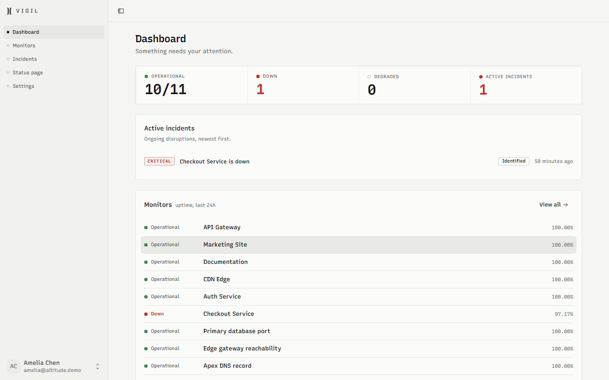

<picture>
  <source media="(prefers-color-scheme: dark)" srcset="docs/brand/vigil-mark.svg">
  
</picture>

# Vigil Core

**Self-hosted uptime monitoring, incidents and status pages.** Two
processes and one Postgres: no Redis, no queue broker, no agents to
install.

[](LICENSE)
[](docs/DEPLOYMENT.md)



---

## What it does

- **Forty check types**, behind a registry. The web: HTTP(S), JSON
  query, a real browser engine, TCP/port, UDP, ping (ICMP), DNS records,
  TLS-certificate and domain-registration expiry. Databases: PostgreSQL,
  MySQL / MariaDB, MongoDB, Redis, SQL Server, Oracle, Elasticsearch,
  Memcached. Messaging: MQTT, Kafka, RabbitMQ. Infrastructure: SSH, FTP,
  IMAP, SMTP, LDAP, NTP, SNMP, RADIUS, gRPC, WebSocket, SIP, Docker
  containers, systemd services, Tailscale, Globalping, Steam and GameDig.
  And three that dial nothing: push heartbeats, groups derived from other
  monitors, and a status an operator sets by hand. Adding one is five
  files and no dispatch to edit. Everything but PostgreSQL speaks the
  wire protocol directly, so **not one of them added a dependency**:
  twenty-six types arrived since 1.12.0 and `package.json` is unchanged.
- **Assertions**: expected status, response-time thresholds, body
  contains or does not contain a keyword, DNS record values, days left
  on a certificate. A 200 that serves an error page is caught.
- **Scheduling that adapts.** The interval you set is a baseline: a
  suspicious monitor is probed harder and a steady one backs off. The
  minimum is two seconds on the ordinary scheduler, or 500 ms for
  HTTP, JSON and TCP monitors on the high-frequency plane.
- **Incidents**: opened and resolved by the check loop, with a failure
  window measured in seconds rather than a count of checks. Severity, a
  lifecycle, an append-only timeline, internal-only notes and a
  markdown postmortem.
- **Status pages**: as many as you like, each with its own URL,
  components, 90-day uptime bars and incident history. Public, private
  or password-protected, with double-opt-in email subscribers.
- **Team and roles**: owner, admin, responder, viewer. Viewers are
  read-only at the server boundary, not by hiding a button.
- **Audit trail**: every mutation recorded with actor, target and
  metadata, and a page to read it on.
- **Alerts**: email plus HMAC-signed webhooks that auto-format for
  Slack and Discord.

No license key, no telemetry, no expiry, and no cap on monitors, users,
organizations' members or retention.

## Quick start

```bash
git clone https://github.com/sikurdev/vigil-core.git
cd vigil-core
cp .env.example .env      # set DATABASE_URL and BETTER_AUTH_SECRET
docker compose up -d
```

Then open http://localhost:3000. [QUICK_START.md](QUICK_START.md) has the
bare-metal path and the first-monitor walkthrough.

## Limitations

Worth knowing before you deploy:

- **Checks run from one host.** A monitor going down means _your Vigil
  host_ could not reach it. The failure window filters blips, but this is
  not multi-region confirmation and never claims to be. Run Vigil outside
  the blast radius of what it watches.
- **25 native provider types, unlimited channels, plus member email**:
  Slack, Discord, Microsoft Teams, Telegram, Google Chat, Mattermost,
  Rocket.Chat, Matrix, Zulip, LINE, PagerDuty, Jira Service Management,
  Pushover, Gotify, ntfy, Pushbullet, Bark, Web Push, Home Assistant,
  Twilio SMS, Twilio WhatsApp, SMTP, Resend, signed webhooks and Amazon
  SNS. Uptime Kuma 2.4.0 ships 94 notification providers, so the gap is
  still real and it is still theirs: a service on their list and not on
  this one routes there today and not here. What narrows it is the
  Apprise bridge - point Vigil at an Apprise server you run and it will
  forward to whatever that server is configured for. That is a bridge,
  not an integration: those services are not implemented, pinned or
  tested here, and none of them is counted in the 25.
- **An import is not a migration of everything.** Every one of Kuma's 31
  selectable monitor types has an equivalent here, but a type having one
  is not a promise that every monitor of that type comes across: Vigil's
  own rules still refuse what they would refuse from the form, and
  notification providers, tags and maintenance windows have no
  counterpart and are reported rather than carried. `docs/KUMA-IMPORT.md`
  states both numbers and lists every refusal.
- **One organization per install.** Fine for a team watching its own
  systems; not built to run many separate clients side by side.

## How this repository is produced

Vigil Core is not maintained by hand. It is generated from the
commercial edition's tree by deleting every file and statement marked
`@edition:ee`. That same script runs in a required job on every push and
pull request there: it strips the tree, then lints, typechecks, tests,
builds, migrates onto an empty Postgres and serves HTTP from what is
left, so Core cannot quietly fall behind. If it did, the build would be
red before the release existed.

Both editions are cut from the same commit and carry the same version
number. **If this repository's version ever trails the commercial one,
the mechanism is broken and you are looking at the evidence.**

History is never rewritten here and releases are never force-pushed, so
a pull request always has somewhere to land.

## Contributing

[CONTRIBUTING.md](CONTRIBUTING.md): there is no CLA and no copyright
assignment, and it says plainly what Apache-2.0 lets the maintainer do
with your contribution. Security issues go privately to
[SECURITY.md](SECURITY.md), not to the issue tracker.

## The commercial edition

[Vigil](https://vigil-uptime.com) is the same monitor with five things
Core does not have, none of which Uptime Kuma has either:

- **Isolate.** Many client organizations in one install, each with its
  own status pages and unable to see the others.
- **Rotate.** On-call schedules and escalation ladders that know whose
  turn it is tonight, with acknowledgement stopping the ladder.
- **Reach.** SMS and voice through your own Twilio account.
- **Repair.** Automatic recovery: verify the failure, call a restart
  hook you own with a signed payload, verify it came back, and page a
  human only if it did not.
- **Confirm.** Probe agents you run on your own machines, in the regions
  you choose, with a quorum deciding the verdict. Vigil ships the agent
  and hosts nothing.

Everything else (every check type, the scheduler, the ledger, the audit
page, subscribers, password-protected pages) is here, free, and stays
here. [What we commit to, in writing](https://vigil-uptime.com/commitments.html).

## License

[Apache-2.0](LICENSE). Run it, modify it, keep your changes private, run
it for clients, sell it. There is no copyleft obligation. Vigil Core was
AGPL-3.0 through 1.0.1; copies obtained under that license remain
available under it.
