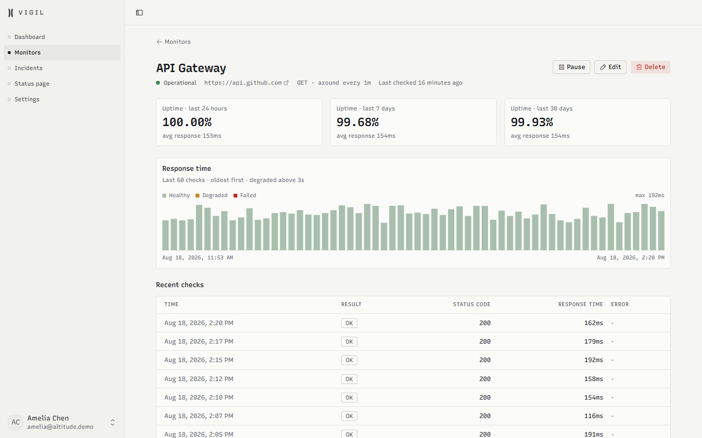
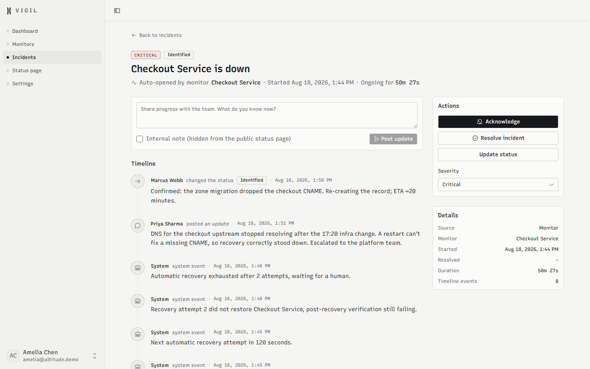
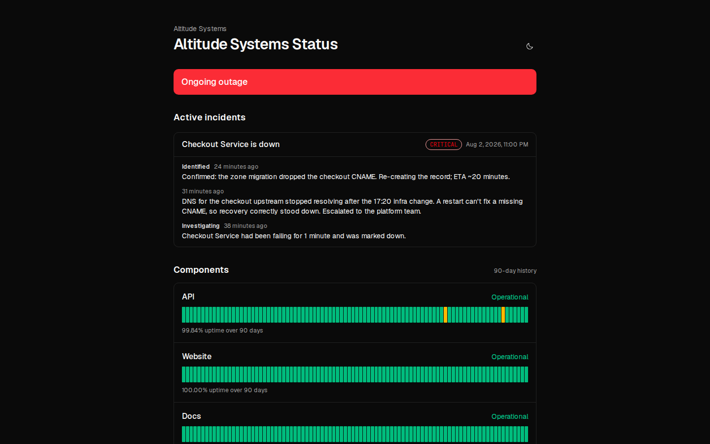

# Vigil Core

**Self-hosted uptime monitoring, incident tracking and a public status
page.** Two processes and one Postgres — no Redis, no queue broker, no
agents to install.

[](LICENSE)
[](docs/DEPLOYMENT.md)


---

## What it does

|                        |                                                                                                                                                              |
| ---------------------- | ------------------------------------------------------------------------------------------------------------------------------------------------------------ |
| **HTTP(S) monitoring** | Configurable interval, timeout, expected status code and degraded-response threshold. Consecutive-failure threshold before anything opens.                   |
| **Keyword assertions** | Assert the response body _contains_ (or _doesn't contain_) a string — catches the 200 that serves an error page.                                             |
| **Incidents**          | Opened and resolved automatically by the checker, or by hand. Severity, status lifecycle, an immutable timeline, internal-only notes and a postmortem field. |
| **Public status page** | One per install, on your own domain, with per-monitor display names, 90-day uptime bars and incident history.                                                |
| **Alerts**             | Email, plus signed webhooks that auto-format for Slack and Discord (detected from the webhook URL). Every payload carries an `X-Vigil-Signature` HMAC.       |
| **Team**               | Invite teammates with roles — owner, admin, responder, viewer. Viewers are read-only and never see signing secrets.                                          |
| **Audit trail**        | Every mutation recorded with actor, target and metadata.                                                                                                     |

Built with Next.js 16, Postgres 18, Drizzle and pg-boss. **161 tests**,
lint and typecheck clean, Docker images for app and worker.

<details>
<summary>More screenshots</summary>





</details>

---

## Quick start

```bash
git clone https://github.com/artaspervyj-dotcom/vigil-core.git
cd vigil-core
cp .env.example .env          # set DATABASE_URL and BETTER_AUTH_SECRET
npm install
npm run db:migrate
npm run dev                   # terminal 1 — the app
npm run worker:dev            # terminal 2 — background checks
```

Open <http://localhost:3000>, sign up, and you own the install. Want
sample data to look at first? `npm run db:seed` creates a demo team with
five monitors, 90 days of history and a published status page.

Docker, managed platforms and bare metal: [docs/DEPLOYMENT.md](docs/DEPLOYMENT.md).

## Documentation

|                                                |                                                        |
| ---------------------------------------------- | ------------------------------------------------------ |
| [QUICK_START.md](QUICK_START.md)               | Install and run in under ten minutes                   |
| [docs/DEPLOYMENT.md](docs/DEPLOYMENT.md)       | Docker Compose, managed platforms, bare metal, backups |
| [ARCHITECTURE.md](ARCHITECTURE.md)             | How the pieces fit, and why                            |
| [docs/CUSTOMIZATION.md](docs/CUSTOMIZATION.md) | Branding, roles, common extensions                     |
| [docs/HANDBOOK.md](docs/HANDBOOK.md)           | Commands, conventions, debugging                       |
| [docs/DEMO.md](docs/DEMO.md)                   | Running a public read-only demo                        |
| [docs/UPGRADE.md](docs/UPGRADE.md)             | Taking updates after you customize                     |
| [CONTRIBUTING.md](CONTRIBUTING.md)             | Sending a patch                                        |

## Honest limitations

Worth knowing before you deploy:

- **Checks run from one host.** A monitor going down means _your Vigil
  host_ could not reach it. The failure threshold filters blips, but this
  is not multi-region confirmation and never claims to be. Run Vigil
  outside the blast radius of what it watches.
- **HTTP(S) only.** No TCP, ping, DNS or push/heartbeat checks.
- **No SMS or phone paging**, and no on-call schedules.
- **No password reset yet** — a forgotten password means an admin
  re-invites you. It's the top item on the list.
- **One organization per install.** Fine for a team; not built to run
  many separate clients side by side.

If any of these are blockers, [Uptime Kuma](https://github.com/louislam/uptime-kuma)
is excellent and free, and Better Stack does managed global probes well.
Use what fits.

## What the commercial edition adds

Vigil Core is the free, complete, self-hostable monitor above. A
commercial edition at **[vigil-uptime.com](https://vigil-uptime.com)**
builds on the same codebase and adds the things agencies and MSPs asked
for:

- **Automatic recovery** — Vigil verifies the failure, calls your restart
  hook with a signed payload, then verifies the fix. Humans are paged
  only when the automation loses.
- **Many client organizations in one install**, each with its own
  branded status page — run monitoring for all your clients from one
  deployment.
- **On-call schedules and escalation policies**, with SMS and voice.
- **Status-page email subscriptions** (double opt-in), and
  private/password-protected status pages.
- **TCP/port monitors and TLS-certificate expiry checks.**

Core is not crippled to sell that: nothing here is gated behind a
license key, there is no telemetry, and no feature stops working. If
Core is all you need, that's the intended outcome.

## Contributing

Issues and pull requests are welcome — see
[CONTRIBUTING.md](CONTRIBUTING.md). Security issues go privately to
[SECURITY.md](SECURITY.md), not to the issue tracker.

## License

[Apache-2.0](LICENSE). You can run, modify and redistribute this
freely, including commercially, and you are not required to publish
your changes — including when you offer a modified version to others
over a network. Vigil Core was AGPL-3.0 until this release; Apache is
the weaker licence for us and the more adoptable one for you.

The copyright holder also offers the code under a separate commercial
licence; that dual-licensing is why the commercial edition above can
exist alongside this one.
